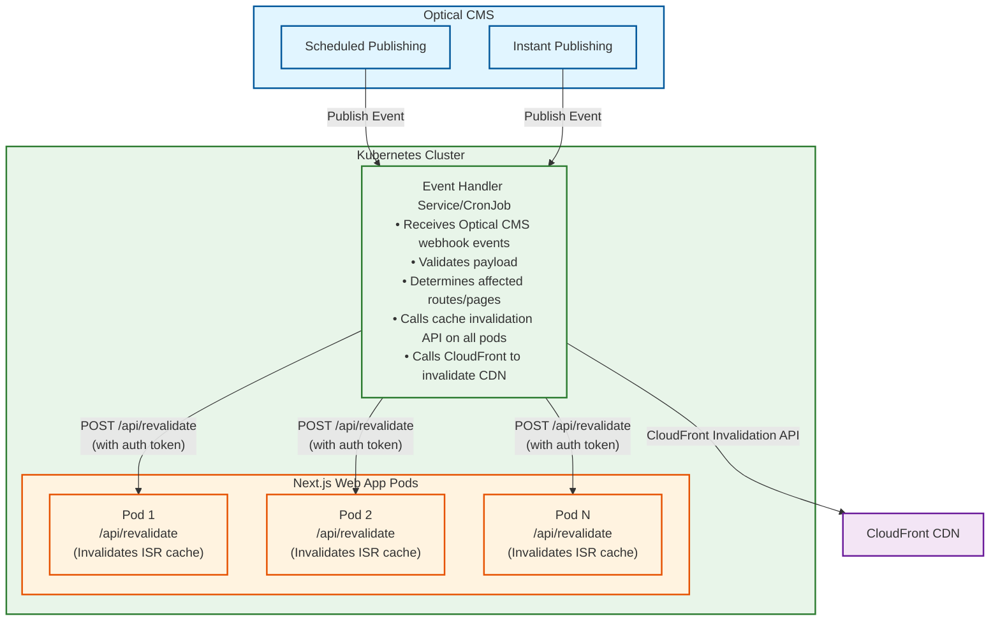

# On-demand Cache Invalidation System

## JIRA Ticket Summary

**Title:** Implement On-Demand Cache Invalidation System for Directus CMS Publishing Events

**Description:**
Design and implement an automated cache invalidation system that triggers when Optical CMS publishes content (both scheduled and instant publishing). The system consists of three main components:

1. **Optical CMS** - Source of publishing events (scheduled and instant)
2. **Kubernetes Event Handler** - Receives webhook events from Optical CMS and orchestrates cache invalidation
3. **Next.js Web App Pods** - Exposes ISR cache invalidation API (running on multiple pods)

**Flow:**
- Optical CMS triggers webhook on content publish -> Kubernetes Event Handler receives event -> Calls cache invalidation API on all web app pods -> Each pod invalidates its ISR cache -> Kubernetes also calls CloudFront API to invalidate CDN cache

**Benefits:**
- Ensures content freshness across web app and CDN
- Supports both scheduled and instant publishing workflows
- Centralized cache invalidation orchestration

---

## High-Level System Diagram

---

## Component Details

### 1. Optical CMS
- **Responsibility:** Publish content and trigger webhooks
- **Events:**
  - `items.create`
  - `items.update`
  - `items.delete`
- **Configuration:** Webhook URL pointing to Kubernetes cluster endpoint

### 2. Kubernetes Event Handler
- **Responsibility:** Orchestrate cache invalidation workflow
- **Implementation Options:**
  - Kubernetes Service (REST API)
  - Kubernetes CronJob (for scheduled checks)
- **Tasks:**
  - Receive and validate Optical CMS webhook payloads
  - Map content changes to affected routes
  - Call cache invalidation API on all web app pods with authentication
  - Call CloudFront API to invalidate CDN cache

### 3. Next.js Web App Pods
- **Responsibility:** Execute ISR cache invalidation
- **API Endpoint:** `/api/revalidate`
- **Tasks:**
  - Validate incoming requests (secret token)
  - Use Next.js ISR `revalidatePath()` or `revalidateTag()`
  - Return detailed invalidation results
