This is a comprehensive [Next.js](https://nextjs.org) demonstration project designed to explore modern web rendering strategies and performance monitoring. It integrates with [Directus](https://directus.io) as a headless CMS to provide real-world data fetching scenarios.

### 🚀 Core Objectives: Rendering Patterns & Memory Profiling

The primary goal of this project is to visualize and compare the lifecycle of different Next.js rendering patterns. It provides hands-on examples to understand:

- **SSG (Static Site Generation):** Pre-rendering pages at build time for maximum speed and SEO.
- **ISR (Incremental Static Regeneration):** Updating static content after deployment without a full rebuild.
- **SSR (Server-Side Rendering):** Generating HTML on-demand for each request to ensure data is always fresh.
- **CSR (Client-Side Rendering):** Handling data fetching and UI updates directly in the browser.

Beyond rendering, this project includes a detailed guide on **Memory Profiling**, allowing developers to track heap allocations and identify potential memory leaks in a Node.js environment.

## Getting Started

To demo rendering patterns, we need to build and run on production mode.

### 1. Setup Web app ENV variable and update DB file for directus

- Update file **.env** with the token you created on Directus CMS.
- Using this DB file: [Directus DB docker](https://github.com/letrthang/nextjs-page-rendering-patterns-demo/blob/main/database/data.db) for your Directus docker. See docker-compose.yml to know how it is mapping.

### 2. Install packages

`pnpm install`

### 3. Build and Run on production mode (we build with standalone mode)

`pnpm build && pnpm start`

Or

`node .next/standalone/server.js`

### 4. Start Directus CMS docker and Access web app and CMS

- Open CMS at: [http://localhost:8055](http://localhost:8055)

- Open web app at: [http://localhost:3000](http://localhost:3000)

You can start editing the page by modifying `app/page.tsx`. The page auto-updates as you edit the file.

This project uses [`next/font`](https://nextjs.org/docs/app/building-your-application/optimizing/fonts) to automatically optimize and load [Geist](https://vercel.com/font), a new font family for Vercel.


## Architecture and Deployment

### Architecture - https://directus.io vs Next.js
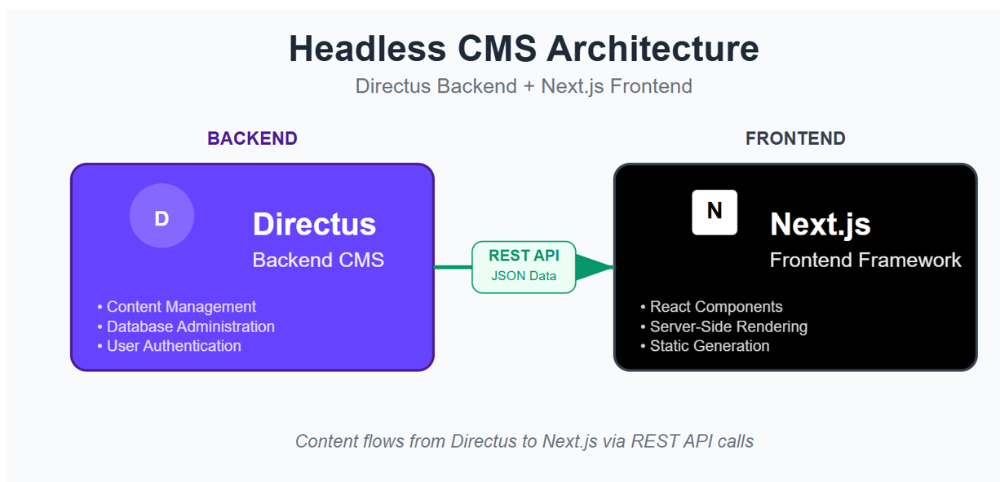


### Deployment 

- You should set up Directus on docker (docker-compose.yml) and copy file */database/data.db* to replace your data.db file and run Next.js app on **dev** mode with ` pnpm run dev`. For **prod** mode, see above section.

You could see the home page as below:


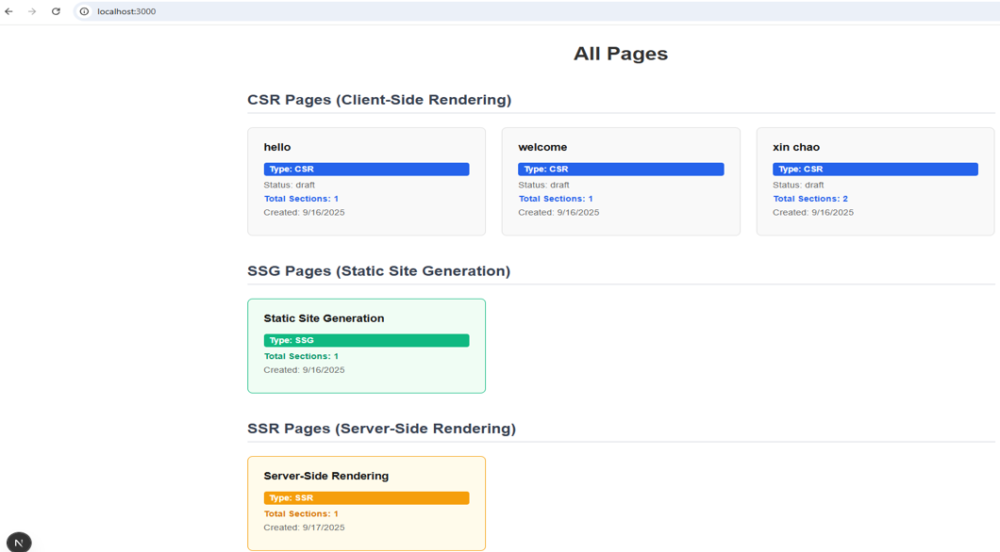

### Rendering Patterns Matrix

Next.js rendering patterns are determined by two key configuration options:

**`generateStaticParams`** - Defines which dynamic routes to pre-render at build time
- ✅ Present → Pages pre-rendered and stored in Docker image
- ❌ Absent → Pages generated on-demand at request time

**`revalidate`** - Controls when/how pages regenerate
- `false` or absent → Never regenerate (pure static)
- `number` (e.g., 1800) → ISR with time-based revalidation
- `0` or `cache: 'no-store'` → SSR (render on every request)

**Client components** (`'use client'`) bypass server rendering and fetch data in the browser.

The matrix below shows how these options combine to create different rendering patterns:

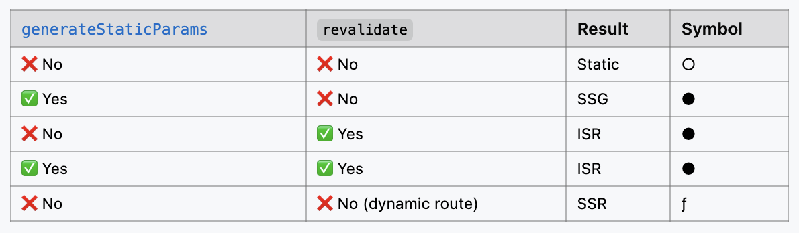

**Understanding Next.js build output symbols:**

When you run `pnpm build`, Next.js displays route information with these symbols:

- **○** (Hollow circle) = Static - Prerendered as static content (SSG without `generateStaticParams`)
- **●** (Filled circle) = SSG/ISR - Prerendered as static HTML using `generateStaticParams`
- **ƒ** (Lambda) = Dynamic - Server-rendered on demand (SSR/CSR)

**Important distinction:**

```
Route (app)
├ ● /ssg_page/[id]      ← Pre-rendered at build time, NEVER regenerates
├ ● /isr_page/[id]      ← Pre-rendered at build time, regenerates every xx seconds (xx = revalidate time)
└ ƒ /ssr_page/[id]      ← NOT pre-rendered, renders on each request
```

**Both SSG and ISR use the ● symbol** because both pre-render pages at build time with `generateStaticParams`. The key difference:
- **SSG**: Pre-rendered once, never changes until next build
- **ISR**: Pre-rendered at build, then regenerates periodically based on `revalidate` time

⚠️ **Common misconception**: "Only SSG pre-renders at build time"
- **Reality**: Both SSG and ISR pre-render at build time. ISR adds automatic regeneration on top of that.

---

### SSG - Static Site Generation

**Source:** `src/app/ssg_page/[id]/page.tsx`

**Method:** Uses `generateStaticParams` to pre-render pages at build time

**Pre-rendered pages are stored at:**
- `.next/server/app/ssg_page/` (standard build - used by `pnpm start`)
- `.next/standalone/.next/server/app/ssg_page/` (standalone build - used by `node .next/standalone/server.js`)

**Generated files per page:**
- `{id}.html` - Pre-rendered HTML content
- `{id}.rsc` - React Server Component payload
- `{id}.meta` - Metadata and configuration
- `{id}.segments/` - Code splitting segments

**Data fetching:** Direct call to Directus API at build time (server-side only)

#### Understanding Next.js Static Chunks and CDN Caching

**Static chunks location:**
```
.next/static/chunks/
├── ff1a16fafef87110.js  ← Code-split JavaScript bundle
├── a6dad97d9634a72d.js  ← Shared libraries chunk
└── ...
```

**How chunks are loaded:**

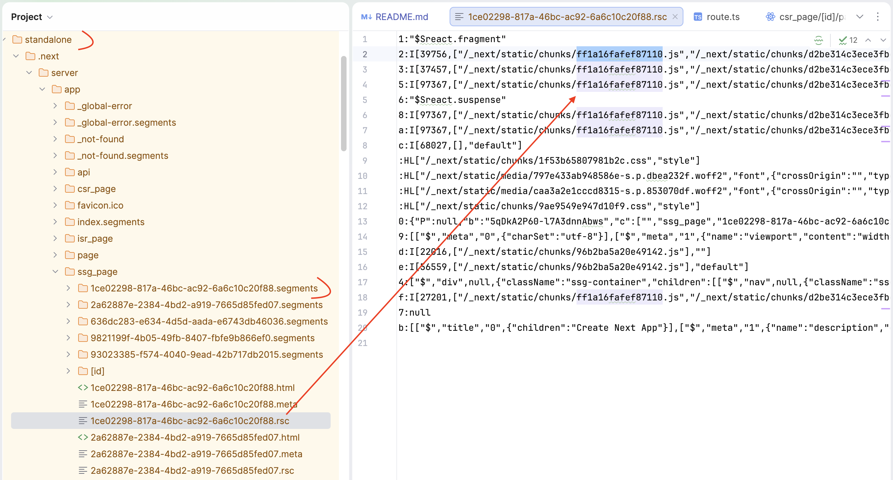
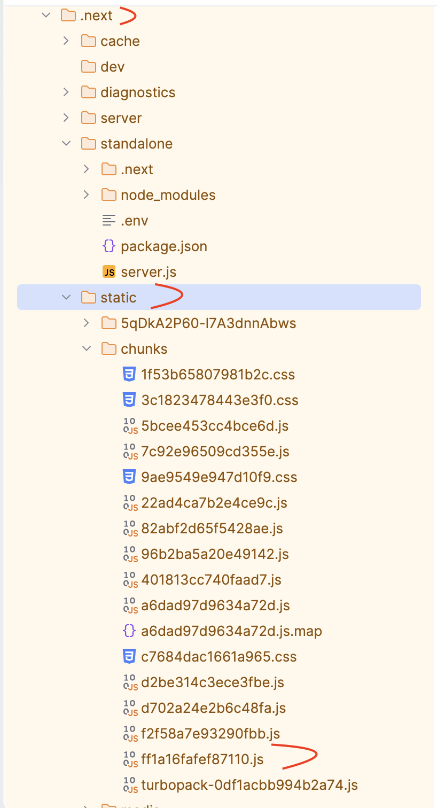

1. HTML/RSC files reference chunks: `<script src="/_next/static/chunks/ff1a16fafef87110.js"></script>`
2. Browser downloads chunks from `.next/static/chunks/`
3. Hash-based filename (e.g., `ff1a16fafef87110`) = content fingerprint
   - Same code → same hash → effective caching
   - Changed code → new hash → new filename

**CDN caching strategy:**
- Static chunks use: `Cache-Control: public, max-age=31536000, immutable`
- Cached for 1 year with no revalidation (hash changes = new file)

**Common deployment issue: Missing old hash files**

**Problem:**
```
Deployment 1: .next/static/chunks/abc123.js (user's browser cached this)
Deployment 2: .next/static/chunks/xyz789.js (new build DELETES abc123.js)
Result: User gets 404 error trying to load abc123.js ❌
```

**Solutions:**

#### Solution 1: Clear ALL CDN cache after deployment (Simplest for ephemeral pods)

**When to use:** Kubernetes/Docker deployments with ephemeral storage and CDN (CloudFront, Cloudflare, etc.)

**Why this works:**
- After deployment, new pod only has new chunks (xyz789.js)
- Old chunks (abc123.js) are gone from pod
- Clearing ALL CDN cache forces fresh fetch of both HTML and chunks
- No mismatch between cached HTML and available chunks

**Implementation:**
```bash
# GitLab CI/CD pipeline (.gitlab-ci.yml)
after_deploy:
  - |
    # Clear entire CloudFront/CDN cache
    aws cloudfront create-invalidation \
      --distribution-id $CLOUDFRONT_ID \
      --paths "/*"

    # OR for Cloudflare
    curl -X POST "https://api.cloudflare.com/client/v4/zones/$ZONE_ID/purge_cache" \
      -H "Authorization: Bearer $CF_TOKEN" \
      -d '{"purge_everything":true}'
```

**Trade-offs:**
- ✅ Simple, no infrastructure changes needed
- ✅ Guarantees no 404 errors from mismatched chunks
- ✅ Works with ephemeral pod storage
- ⚠️ First request after deployment is slower (cache miss)
- ⚠️ Temporarily higher load on origin pods

**Cache strategy with this approach:**
```typescript
// next.config.ts - Keep your desired cache times
async headers() {
  return [
    {
      source: '/:path*',
      headers: [{
        key: 'Cache-Control',
        value: 's-maxage=1800, stale-while-revalidate=600', // 30min cache
      }],
    },
    {
      source: '/_next/static/:path*',
      headers: [{
        key: 'Cache-Control',
        value: 'public, max-age=31536000, immutable', // 1 year cache
      }],
    },
  ];
}
```

---

#### Solution 2: Don't invalidate static chunks (Recommended for persistent storage)

**When to use:** When you can preserve old static files across deployments

**Why this works:**
- Static chunks use hash-based filenames (abc123.js vs xyz789.js)
- New deployment = new hash = new filename
- Old chunks can stay cached forever because new HTML references new chunks
- Only invalidate HTML/pages, not `/_next/static/*`

**Implementation:**
```bash
# GitLab CI/CD - Only invalidate HTML, NOT static assets
after_deploy:
  - |
    aws cloudfront create-invalidation \
      --distribution-id $CLOUDFRONT_ID \
      --paths "/" "/page/*" "/ssg_page/*" "/isr_page/*" "/ssr_page/*"
    # Do NOT include "/_next/static/*"
```

**Requires:** Persistent storage for static files (S3, persistent volumes, or merged deployments)

**Key insight:** Static chunks use immutable caching. Once cached with hash `abc123.js`, browsers expect it to exist forever. When using ephemeral pod storage, clear all CDN cache after deployment to prevent 404 errors.

---

**🎯💡Hybrid Rendering - SSG with Client Components: 🎯**

SSG pages can embed client components (`'use client'`) for dynamic interactivity while maintaining pre-rendered HTML. This demonstrates that **"pure SSG" can still have dynamic, interactive content**.

**Example from this project:**

```typescript
// src/app/ssg_page/[id]/page.tsx (Server Component - SSG)
import TitleDialog from './TitleDialog'; // ← Client Component

export default async function SSGPageDetail({ params }) {
  const data = await getSSGPageData(id); // Pre-rendered at build time
  const randomNumber = generateRandomNumber(); // Generated at build time

  return (
    <div>
      <h1>{data.page.title}</h1>
      <TitleDialog title={data.page.title} randomNumber={randomNumber} />
      {/* ↑ Client component - interactive, NOT pre-rendered */}
    </div>
  );
}
```

```typescript
// src/app/ssg_page/[id]/TitleDialog.tsx (Client Component)
'use client';
import { useState } from 'react';

export default function TitleDialog({ title, randomNumber }) {
  const [isOpen, setIsOpen] = useState(false);
  const [currentTimestamp, setCurrentTimestamp] = useState('');

  const handleOpen = () => {
    setCurrentTimestamp(new Date().toISOString()); // ← Dynamic, runs in browser
    setIsOpen(true);
  };

  return <button onClick={handleOpen}>Show Title Dialog</button>;
  // Dialog displays:
  // - title: from SSG (build time) -> never change
  // - randomNumber: from SSG (build time) -> never change
  // - timestamp: from browser (runtime) -> this keeps changing every click
}
```

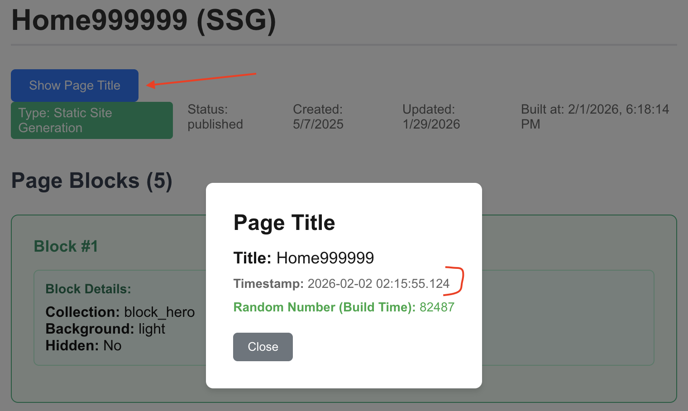

**What gets pre-rendered vs. what's dynamic:**

| Component | Pre-rendered? | When it runs |
|-----------|---------------|--------------|
| SSG page HTML | ✅ Yes | Build time (baked in Docker image) |
| `title` from CMS | ✅ Yes | Build time (fetched from Directus) |
| `randomNumber` | ✅ Yes | Build time (generated once) |
| `TitleDialog` component | ❌ No | Browser (hydrates after page loads) |
| `timestamp` | ❌ No | Browser (generated on button click) |
| Button interactions | ❌ No | Browser (event handlers run client-side) |

**Key takeaway:**
- ✅ **SSG page structure**: Pre-rendered, static HTML with CMS data
- ✅ **Client components within**: Hydrate in browser, add interactivity
- ✅ **Props from SSG to client**: Static data passed from build time to runtime
- ✅ **Client state**: Dynamic data generated in browser (timestamps, user input, etc.)

**This hybrid approach allows SSG to have:**
* Fast initial load (pre-rendered HTML)
* SEO benefits (content in HTML)
* Rich interactivity (client components)
* Dynamic features (without sacrificing static benefits)
* Do note that **TitleDialog** is a client component, not a CSR page. **TitleDialog** is a client component that:
  1. Has NO separate route/URL 
  2. Is imported and used within the SSG page 
  3. Receives props from the server component (title, randomNumber)
  4. Hydrates in the browser after the SSG page loads 
  5. Adds interactivity to an otherwise static page

---

### ISR (Incremental Static Regeneration)

**Source:** `src/app/isr_page/[id]/page.tsx`

**Method:** Combines static generation with time-based revalidation for fresh content without full rebuilds

**Configuration:**
```typescript
export const revalidate = 1800; // Revalidate every 30 minutes

export async function generateStaticParams() {
  // Pre-render pages at build time
  const response = await fetch(`${process.env.DIRECTUS_URL}/items/pages`, {
    headers: { 'Authorization': `Bearer ${process.env.DIRECTUS_TOKEN}` },
  });
  const data = await response.json();
  return data.data.map((page: Page) => ({ id: page.id.toString() }));
}
```

**Pre-rendered pages are stored at:**
- `.next/server/app/isr_page/` (standard build - used by `pnpm start`)
- `.next/standalone/.next/server/app/isr_page/` (standalone build - used by `node .next/standalone/server.js`)

**Generated files per page:**
- `{id}.html` - Pre-rendered HTML content (regenerates every 30 min)
- `{id}.rsc` - React Server Component payload
- `{id}.meta` - Metadata with revalidation timestamp
- `{id}.segments/` - Code splitting segments

**Data fetching:** Direct call to Directus API (server-side only)

**How ISR works:**
1. **Build time (if using `generateStaticParams`):** Pages pre-rendered and stored in Docker image
2. **Runtime:** Pages served from cache
3. **After revalidation period (30 min):** Next request triggers background regeneration with fresh CMS data
4. **Stale-while-revalidate:** Users get instant response with cached page while new version generates

**Configuration with `generateStaticParams`:**
```typescript
// src/app/isr_page/[id]/page.tsx
export const revalidate = 1800; // Revalidate every 30 minutes

export async function generateStaticParams() {
  // Pre-render pages at build time
  const response = await fetch(`${process.env.DIRECTUS_URL}/items/pages`, {
    headers: { 'Authorization': `Bearer ${process.env.DIRECTUS_TOKEN}` },
  });
  const data = await response.json();
  return data.data.map((page: Page) => ({ id: page.id.toString() }));
}
```

**Important for ephemeral pods (Docker/Kubernetes):**

When using `generateStaticParams`, pages are pre-rendered at build time and baked into the Docker image. After pod deployment, these pages will serve stale content until the revalidation period expires (30 minutes in this case).

**Solution: Invalidate cache on pod startup**

To ensure fresh content immediately after deployment, trigger on-demand revalidation when the pod starts:

**Step 1: Create revalidation API route**
```typescript
// src/app/api/revalidate/route.ts
import { revalidatePath, revalidateTag } from 'next/cache';
import { NextRequest, NextResponse } from 'next/server';

export async function POST(request: NextRequest) {
  const secret = request.nextUrl.searchParams.get('secret');

  if (secret !== process.env.REVALIDATE_SECRET) {
    return NextResponse.json({ message: 'Invalid secret' }, { status: 401 });
  }

  try {
    // Revalidate all ISR pages
    revalidatePath('/isr_page/[id]', 'page');
    return NextResponse.json({
      revalidated: true,
      message: 'All ISR pages revalidated'
    });
  } catch (err) {
    return NextResponse.json({
      message: 'Error revalidating'
    }, { status: 500 });
  }
}
```

**Step 2: Trigger revalidation after pod startup**

Option A - In GitLab CI/CD:
```bash
# .gitlab-ci.yml
after_deploy:
  - |
    # Wait for pod to be ready
    kubectl wait --for=condition=ready pod -l app=nextjs --timeout=120s

    # Trigger revalidation
    POD_NAME=$(kubectl get pods -l app=nextjs -o jsonpath='{.items[0].metadata.name}')
    kubectl exec $POD_NAME -- curl -X POST \
      "http://localhost:3000/api/revalidate?secret=${REVALIDATE_SECRET}"
```

Option B - Kubernetes PostStart Hook:
```yaml
# deployment.yaml
spec:
  containers:
  - name: nextjs
    lifecycle:
      postStart:
        exec:
          command:
          - /bin/sh
          - -c
          - |
            sleep 5
            curl -X POST "http://localhost:3000/api/revalidate?secret=${REVALIDATE_SECRET}"
```

**Benefits of this approach:**
- ✅ Keep pre-rendered pages for faster initial pod startup
- ✅ Automatic cache invalidation triggers fresh content from CMS
- ✅ First user request after revalidation gets fresh content
- ✅ Maintains ISR caching benefits (30 min cache)

**CDN caching strategy:**

Configure in `next.config.ts`:
```typescript
export default {
  expireTime: 2400, // 40 minutes total (30 min fresh + 10 min stale)
};
```

Generates: `Cache-Control: s-maxage=1800, stale-while-revalidate=600`
- CDN caches for 30 minutes
- Can serve stale for additional 10 minutes while revalidating
- Total cache window: 40 minutes

**Next.js ISR Built-in Stale-While-Revalidate Behavior:**

Next.js ISR has a built-in stale-while-revalidate mechanism at the **server level** (separate from CDN headers):

```typescript
// src/app/isr_page/[id]/page.tsx
export const revalidate = 1800; // 30 minutes
```

**How it works:**
1. **Before revalidation period (0-30 min)**: Serve cached static page from `.next/server/app/isr_page/`
2. **After revalidation period expires**:
   - **First request**: Serve stale cached page immediately + trigger regeneration in background 🔄
   - **Subsequent requests**: Serve fresh page after regeneration completes ✅

This is essentially **stale-while-revalidate behavior at the Next.js server level** - visitors get instant responses with cached pages while fresh content generates in the background.

**Key difference from CDN `stale-while-revalidate` header:**

| Aspect | CDN Header (`stale-while-revalidate=600`) | ISR (`revalidate = 1800`) |
|--------|------------------------------------------|---------------------------|
| **Level** | HTTP header (CDN/browser cache) | Server-side (Next.js cache) |
| **Controls** | CDN cache behavior | Static page regeneration |
| **Location** | `next.config.ts` headers() | Page component |
| **Purpose** | CDN serves stale while fetching from origin | Next.js serves stale while regenerating static page |

**Official documentation:** https://nextjs.org/docs/app/building-your-application/data-fetching/incremental-static-regeneration

**When to use ISR:**
- ✅ Content updates regularly but not on every request (e.g., news, blog posts, product catalog)
- ✅ Want static performance with fresh content
- ✅ Can tolerate brief stale content (revalidation period)
- ✅ Need to update content without rebuilding entire site

### SSR (Server-Side Rendering)

**Source:** `src/app/ssr_page/[id]/page.tsx`

**Method:** Pages rendered on-demand for each request on the server

**Configuration:**
```typescript
// src/app/ssr_page/[id]/page.tsx
// No special exports needed - SSR is the default for server components

async function getSSRPageData(id: string) {
  try {
    // SSR runs on server, fetch directly from Directus
    const [pageResponse, blocksResponse] = await Promise.all([
      fetch(`${process.env.DIRECTUS_URL}/items/pages/${id}`, {
        headers: { 'Authorization': `Bearer ${process.env.DIRECTUS_TOKEN}` },
        cache: 'no-store', // Always fetch fresh data
      }),
      // ...
    ]);
    // ...
  }
}
```

**Key characteristics:**
- No pre-rendering at build time
- No static files generated
- Each request executes server-side code
- Always fetches fresh data from CMS

**Data fetching:** Direct call to Directus API with `cache: 'no-store'` (server-side only)

**How SSR works:**
1. **User request:** Browser requests page
2. **Server execution:** Next.js server fetches data from Directus
3. **HTML generation:** Server renders React components to HTML
4. **Response:** Sends complete HTML to browser
5. **Hydration:** Browser loads JavaScript and makes page interactive

**Storage:** No pre-rendered pages stored. All rendering happens at request time in the pod.

**CDN caching strategy:**

SSR pages can still benefit from CDN caching:

```typescript
// next.config.ts
async headers() {
  return [
    {
      source: '/ssr_page/:path*',
      headers: [
        {
          key: 'Cache-Control',
          value: 's-maxage=60, stale-while-revalidate=30',
        },
      ],
    },
  ];
}
```

This caches SSR responses at the CDN for 60 seconds, reducing server load.

**When to use SSR:**
- ✅ Need fresh data on every request (real-time data, user-specific content)
- ✅ Data changes frequently and cannot be stale
- ✅ Personalized content based on request headers/cookies
- ✅ SEO important but content too dynamic for ISR

**Trade-offs:**
- ❌ Slower response time (no pre-rendered cache)
- ❌ Higher server load (renders on every request)
- ✅ Always up-to-date content
- ✅ No stale content issues

---

### CSR (Client-Side Rendering)

**Source:** `src/app/csr_page/[id]/page.tsx`

**Method:** Page shell rendered on server, data fetched in browser using React hooks

**Configuration:**
```typescript
'use client'; // Mark as client component

import { useState, useEffect } from 'react';

export default function PageDetail() {
  const [page, setPage] = useState(null);
  const [loading, setLoading] = useState(true);

  useEffect(() => {
    fetchPageData();
  }, []);

  const fetchPageData = async () => {
    // Fetch from API proxy (browser cannot access server env vars)
    const response = await fetch('/api/proxy/items/pages/${id}');
    const data = await response.json();
    setPage(data.data);
  };

  if (loading) return <div>Loading...</div>;
  return <div>{page.title}</div>;
}
```

**Key characteristics:**
- Runs in the browser
- Initial HTML contains loading state
- Data fetched after page loads
- Uses API proxy to hide credentials

**Data fetching:** Browser calls `/api/proxy/items/pages` which proxies to Directus
- ❌ Cannot use `process.env.DIRECTUS_TOKEN` directly (not available in browser)
- ✅ Must use API proxy route to add authentication headers

**API Proxy implementation:**
```typescript
// src/app/api/proxy/[...path]/route.ts
export async function GET(request: NextRequest, { params }) {
  const { path } = await params;
  const targetUrl = `${process.env.DIRECTUS_URL}/${path.join('/')}`;

  const response = await fetch(targetUrl, {
    headers: {
      'Authorization': `Bearer ${process.env.DIRECTUS_TOKEN}`, // Added server-side
    },
  });

  return new NextResponse(await response.text(), {
    status: response.status,
  });
}
```

**How CSR works:**
1. **Initial request:** Server sends minimal HTML with loading state
2. **JavaScript loads:** Browser downloads and executes React code
3. **Data fetch:** Browser calls `/api/proxy/items/pages/${id}`
4. **API proxy:** Next.js server forwards request to Directus with auth token
5. **Render:** Browser updates DOM with fetched data

**Storage:** No pre-rendered pages. Only the app shell is sent to browser.

**Caching strategy:**

```typescript
// Browser-side caching with React Query or SWR (optional)
import useSWR from 'swr';

function PageDetail() {
  const { data, error } = useSWR(`/api/proxy/items/pages/${id}`, fetcher, {
    revalidateOnFocus: false,
    revalidateOnReconnect: false,
  });
}
```

Or rely on browser HTTP cache:
```typescript
// API proxy can set cache headers
responseHeaders.set('Cache-Control', 'public, max-age=300'); // 5 min
```

**When to use CSR:**
- ✅ Interactive features requiring browser APIs (localStorage, geolocation, etc.)
- ✅ Real-time updates (WebSocket, polling)
- ✅ User interactions that don't need SEO (dashboards, admin panels)
- ✅ Content behind authentication

**Trade-offs:**
- ❌ Poor SEO (content not in initial HTML)
- ❌ Slower perceived load time (loading state visible)
- ❌ Requires JavaScript to function
- ✅ Rich interactivity
- ✅ Reduced server load (data fetching offloaded to client)
- ✅ Better for highly interactive UIs

**Comparison with other patterns:**

| Aspect | SSR | CSR |
|--------|-----|-----|
| **SEO** | ✅ Excellent | ❌ Poor |
| **Initial load** | ✅ Fast (full HTML) | ⚠️ Shows loading |
| **Time to interactive** | Fast | Fast |
| **Server load** | High | Low |
| **Fresh data** | Always | On fetch |
| **Credentials** | Direct API | Via proxy |

---

## CDN Cache Control: Setting s-maxage and stale-while-revalidate

Next.js provides two methods to configure Cache-Control headers for CDN caching with `s-maxage` and `stale-while-revalidate` directives.

### Understanding Cache-Control Directives

**`s-maxage`**: How long CDN caches content (in seconds) before considering it stale
**`stale-while-revalidate`**: How long CDN can serve stale content while fetching fresh content in background

**Example:**
```
Cache-Control: s-maxage=1800, stale-while-revalidate=600
```
- CDN caches for 30 minutes (fresh)
- After 30 min, can serve stale for additional 10 minutes while revalidating
- Total cache window: 40 minutes

---

### Method 1: Using `expireTime` (Recommended for ISR pages)

**When to use:** For ISR pages where you want automatic calculation based on `revalidate` time

**Configuration:**

```typescript
// next.config.ts
import type { NextConfig } from "next";

const nextConfig: NextConfig = {
  output: 'standalone',
  expireTime: 2400, // Total cache time in seconds (40 minutes)
};

export default nextConfig;
```

```typescript
// src/app/isr_page/[id]/page.tsx
export const revalidate = 1800; // 30 minutes
```

**How it works:**

Next.js automatically calculates `stale-while-revalidate`:
```
stale-while-revalidate = expireTime - revalidate
                       = 2400 - 1800
                       = 600 seconds (10 minutes)
```

**Generated Cache-Control header:**
```
Cache-Control: s-maxage=1800, stale-while-revalidate=600
```

**Benefits:**
- ✅ Simple, one-line configuration
- ✅ Automatic calculation for all ISR pages
- ✅ Consistent across all routes with `revalidate`
- ✅ No manual header configuration needed

---

### Method 2: Using `headers()` function (For fine-grained control)

**When to use:** When you need different cache strategies for different routes or page types

**Configuration:**

```typescript
// next.config.ts
import type { NextConfig } from "next";

const nextConfig: NextConfig = {
  output: 'standalone',

  async headers() {
    return [
      {
        // ISR pages: 30 min cache + 10 min stale
        source: '/isr_page/:path*',
        headers: [
          {
            key: 'Cache-Control',
            value: 's-maxage=1800, stale-while-revalidate=600',
          },
        ],
      },
      {
        // SSG pages: 1 hour cache + 30 min stale
        source: '/ssg_page/:path*',
        headers: [
          {
            key: 'Cache-Control',
            value: 's-maxage=3600, stale-while-revalidate=1800',
          },
        ],
      },
      {
        // Static assets: 1 year, immutable
        source: '/_next/static/:path*',
        headers: [
          {
            key: 'Cache-Control',
            value: 'public, max-age=31536000, immutable',
          },
        ],
      },
      {
        // Default for other pages
        source: '/:path*',
        headers: [
          {
            key: 'Cache-Control',
            value: 's-maxage=1800, stale-while-revalidate=600',
          },
        ],
      },
    ];
  },
};

export default nextConfig;
```

**Benefits:**
- ✅ Fine-grained control per route
- ✅ Different strategies for different page types
- ✅ Can set custom headers beyond Cache-Control
- ✅ More flexible but requires manual configuration

---

### Method Comparison

| Aspect | `expireTime` | `headers()` |
|--------|-------------|-------------|
| **Configuration** | One line | Multiple route patterns |
| **Flexibility** | Same for all ISR pages | Different per route |
| **Calculation** | Automatic | Manual |
| **Best for** | Simple ISR setup | Complex caching strategies |
| **Maintenance** | Easier | More verbose |

---

### Recommended Configuration for This Project

**For ISR pages with consistent caching:**

```typescript
// next.config.ts
import type { NextConfig } from "next";

const nextConfig: NextConfig = {
  output: 'standalone',
  expireTime: 2400, // 40 minutes total (30 min fresh + 10 min stale)

  // Optional: Add custom headers for static assets
  async headers() {
    return [
      {
        source: '/_next/static/:path*',
        headers: [
          {
            key: 'Cache-Control',
            value: 'public, max-age=31536000, immutable',
          },
        ],
      },
    ];
  },
};

export default nextConfig;
```

```typescript
// src/app/isr_page/[id]/page.tsx
export const revalidate = 1800; // 30 minutes

export async function generateStaticParams() {
  // Pre-render pages at build time
  const response = await fetch(`${process.env.DIRECTUS_URL}/items/pages`, {
    headers: { 'Authorization': `Bearer ${process.env.DIRECTUS_TOKEN}` },
  });
  const data = await response.json();
  return data.data.map((page: Page) => ({ id: page.id.toString() }));
}
```

**Result:**
- ISR pages: `Cache-Control: s-maxage=1800, stale-while-revalidate=600`
- Static chunks: `Cache-Control: public, max-age=31536000, immutable`
- Pages pre-rendered at build time and baked into Docker image
- After deployment, clear web app cache to force fresh content from CMS

## Memory Profiling

### **Step 1: Start app**
- Run web app in local machine with command: ` $env:NODE_OPTIONS="--inspect=0"; npm run dev` OR with prod: `$env:NODE_OPTIONS="--inspect=0"; npm start`

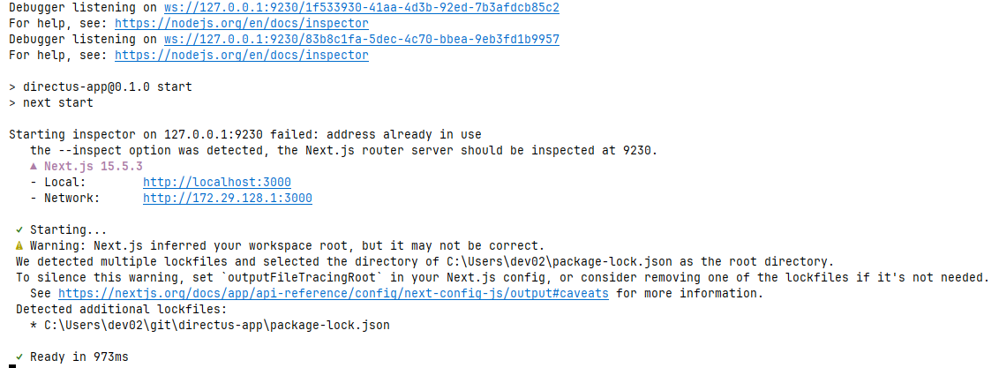


### **Step 2: Open Inspect tool**
1. Open **Chrome** browser (or Edge)
2. In the address bar, type: `chrome://inspect`
3. Press Enter

You should see a page titled **"Devices"**

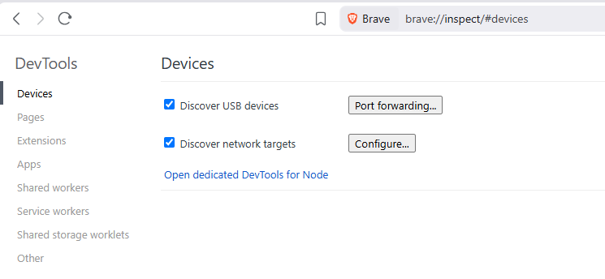


### **Step 3: Configure the Port (if needed)**

1. Click the **"Configure..."** button (near the top)
2. Make sure inspection listener port are in the list:
```
   localhost:9229
   localhost:9230
```
3. If the port is missing, add it
4. Click **"Done"**

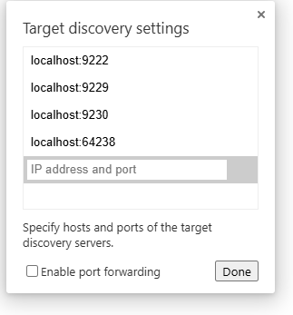

Under **"Remote Target"** section, you should see:
```
Remote Target #LOCALHOST
  Target (v20.14.0)
  file:///.../directus-app/node_modules/next/dist/bin/next
  inspect
```
Click the **"inspect"** link under your Next.js process.

## 📊 **Step 4: Take Allocation Profile**

A new DevTools window will open. Now:

### **Allocation Instrumentation Timeline (Best for Finding Leaks)**

1. Click the **"Memory"** tab (at the top)
2. Select the radio button: **"Allocation instrumentation on timeline"**
3. Click the blue **"Start"** button at the bottom

Now the profiler is recording!

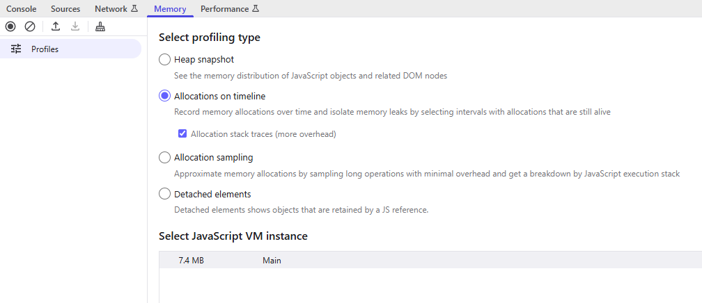

4. **Use your app** - Open another browser tab and move around the page:
`http://localhost:3000`

## 📊 **Step 5: Stop recording and Review results**

Wait for profiling completed and view report

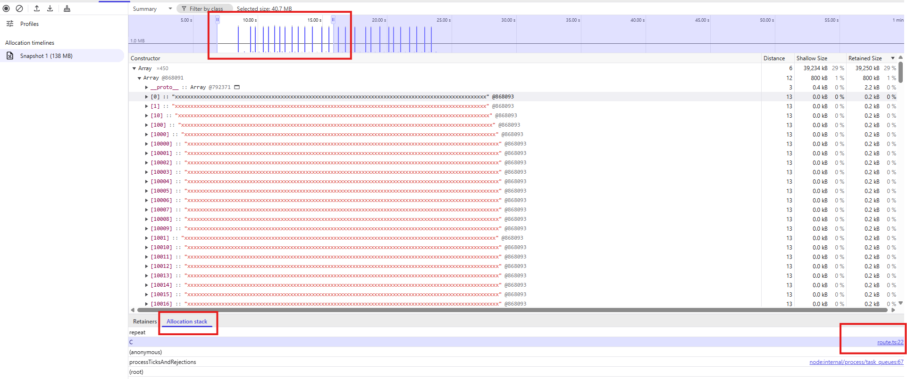


## Learn More

To learn more about Next.js, take a look at the following resources:

- [Next.js Documentation](https://nextjs.org/docs) - learn about Next.js features and API.
- [Learn Next.js](https://nextjs.org/learn) - an interactive Next.js tutorial.

You can check out [the Next.js GitHub repository](https://github.com/vercel/next.js) - your feedback and contributions are welcome!